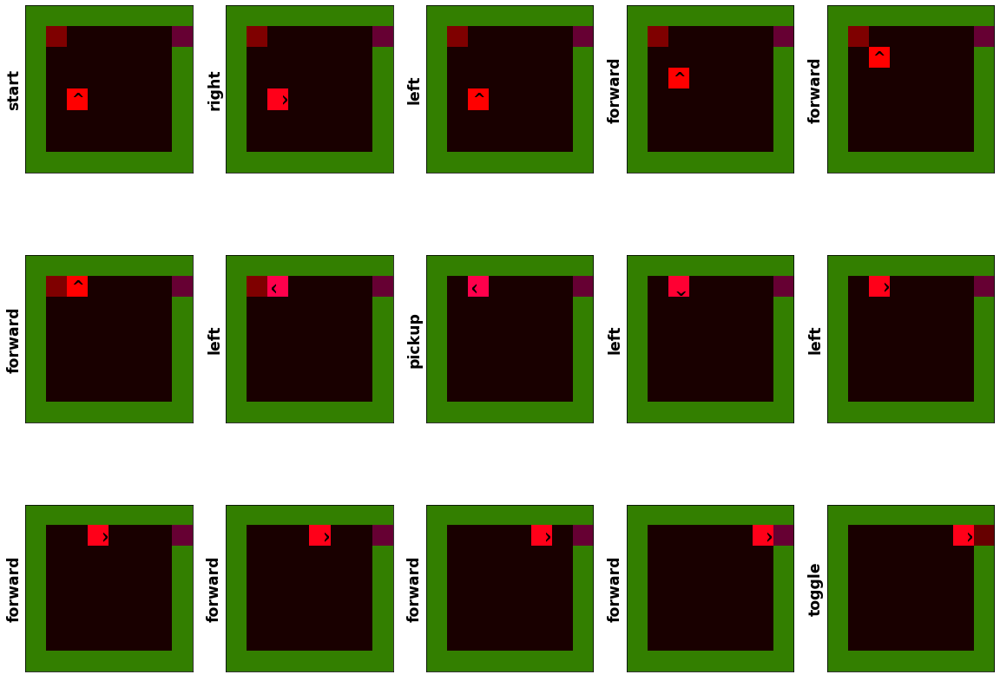

#### Statistical modelling of agent behavior in minimalistic gridworld environments.  

<https://n-harley.github.io/idyog>

## Introduction

- Partial observability, dynamic environments, hidden rewards and explainability are problems for RL models. 
- Supervised learning incorporating knowledge about sub-tasks can mitigate these problems.
- The goal of this work is to learn sub-task knowledge in an unsupervised manner.
- We focus on minimalistic gridworld environments (<https://github.com/maximecb/gym-minigrid>).
- We use an unsupervised learning algorithm called IDyOM (<http://mtpearce.github.io/idyom/>).
- The algorithm constructs statistical models of patterns in agent behavior data.
- We use these models to find the boundaries between sub-tasks.

## Agent Behaviour Data Set

We consider a highly simplified scenario in which a gridworld agent must open a door by first picking up a key. The task here is 'open door'. The (implicit) sub-tasks are 'pickup key' and 'unlock door'. The last element in the sub-task 'pickup key' represents a state in which the previous action is 'pickup', the agent's position is unchanged, and the key is no longer visible.

The objective is to identify this boundary element between the sub-tasks using only the probabilities given by a statistical model build from agent behaviour data.

The [data set](dataset.pkl) contains 1000 example missions recording the agent behavior undertaken to successfully 'open door'. Each example mission begins with a random configuration of agent, key and door. A jupyter notebook for exploring the raw data set can her found [here](https://nbviewer.jupyter.org/github/n-harley/idyog/blob/main/dataset-explorer.ipynb).

## Representation

We represent each example mission as a sequence. Elements in the sequence represents the state of the gridworld at that point in the mission, as well as the action performed immediately prior to entering that state. Each stage in the sequence is represented as a collection of feature values. These features capture abstract information about the grid from both bird's-eye and first-person perspectives. Details of the representation are given below.

<embed src="https://n-harley.github.io/idyog/representation.pdf" type="application/pdf" width="100%" height="500"/>

## Statistical Modelling

The features are used to construct statistical models of the sequences. These models are constructed using IDyOM (<http://mtpearce.github.io/idyom/>). IDyOM is a multiple viewpoint system for capturing statistical patterns in multi-dimensional data. (It was originally applied to musical. However, the basic principle are applicable to any sequence.) We construct a variety of models by running IDyOM with different parameters. Details of these models than their paramters are given [here](./models.md) 

The models give a probability distribution of the next action at each stage in a mission. From this we compute the following:

- Information content `ic` can be see as expectedness of the current element in the context. 
- Entropy `en` can be seen as the the uncertainty of what action will comes next in the current context. 
- Information gain `ig` is the KL divergence between the distributions before and after the current element is processed.

## Sub-Task Boundary Detection

By looking for peaks in these profiles, we can estimate the location of the sub-task boundary between 'pickup key' and 'open door'. To do this we assume that:

1. The `ic` of the boundary element will be low.
2. The `ic` of the element after the boundary element (i.e. the first element of the next sub-task) will be high. 
3. The `en` at the boundary element will be high. 
4. The `en` just before the boundary element will be low. 
5. The `ig` at the boundary element will be high. 

Given these assumptions We consider the following detection methods:

- `min_ic`: minimum information content
- `min_en`: minimum entropy. 

- `max_ic_diff`: maximum increase in information content.
- `max_en_diff`: maximum increase in entropy
- `max_ig_diff`: maximum information gain

- `max_ic_diff_minus1`: one position before the maximum increase in information content
- `max_en_diff_minus1`: one position before the maximum increase in entropy
- `max_ig_diff_minus1`: one position before the maximum increase in information gain

- `max_en_ic`: the maximum of entropy divided by information content
- `max_ig_ic`: the maximum of information gain divided by information content

A jupyter notebook for exploring the different models and boundary estimators can be found [here](https://nbviewer.jupyter.org/github/n-harley/idyog/blob/main/model-explorer.ipynb).

## Results 

We calculate the numbers of correctly identified subtask boundaries for each model and each estimator. A jupyter notebook for computing these results is given [here](https://nbviewer.jupyter.org/github/n-harley/idyog/blob/main/subtask-detection.ipynb).

~75% of the subtask boundaries were correctly identified by using the model [./models#idyom-select-maxlinks2-plus](./models#idyom-select-maxlinks2-plus) and the estimator `max_ig_ic`.

## Further Work

- What models to use? 
- More complex data? 
- 
