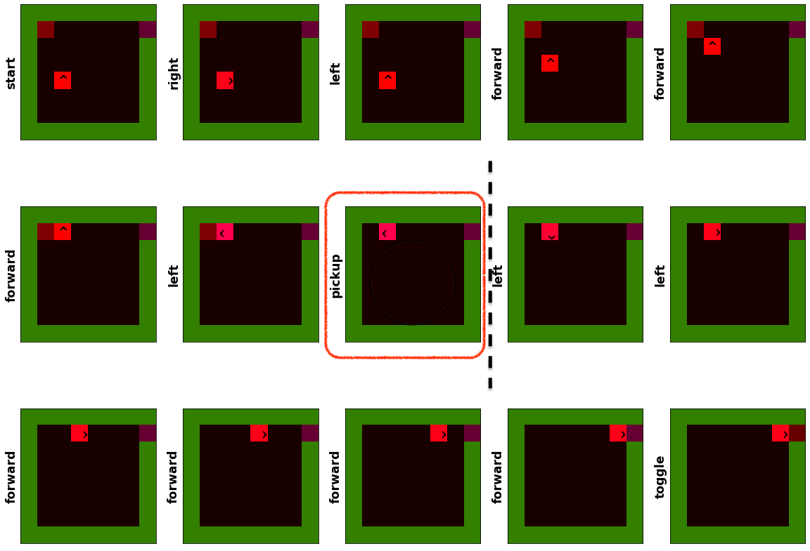

#### Statistical modelling of agent behaviour in minimalistic gridworld environments.

Github repo: <https://www.github.com/n-harley/idyog/>

## Introduction

- Partial observability, dynamic environments, hidden rewards and explainability are problems for RL models. 
- Supervised learning incorporating knowledge about sub-tasks can mitigate these problems.
- The goal of this work is to learn sub-task knowledge in an unsupervised manner.
- We focus on minimalistic gridworld environments (<https://github.com/maximecb/gym-minigrid>).
- We use an unsupervised learning algorithm called IDyOM (<http://mtpearce.github.io/idyom/>).
- We construct statistical models of patterns in agent behavior data.
- We use these models to find the boundaries between sub-tasks.
- ~97% of sub-task boundaries were identified by the method. 

## Agent Behavior Data Set

We consider the simple scenario where a gridworld agent must open a door by first picking up a key. The task here is *open door*. The (implicit) sub-tasks are *pickup key* and *unlock door*. The last element in the sub-task *pickup key* represents a state in which the previous action is *pickup*, the agent's position is unchanged, and the key is no longer visible.

The objective is to identify this highlighted boundary element between the sub-tasks using only the probabilities given by a statistical model built from examples of agent behaviour data.

The [data set](dataset.pkl) contains 1000 example missions recording the agent behavior undertaken to successfully *open door*. Each example mission begins with a random configuration of agent, key and door. A jupyter notebook for exploring the data set can be found [here](https://nbviewer.jupyter.org/github/n-harley/idyog/blob/main/dataset-explorer.ipynb).

## Representation

We represent each example mission as a sequence. Elements in the sequence represents the state of the gridworld at that point in the mission, as well as the action performed immediately prior to entering that state. Each stage in the sequence is represented as a collection of feature values that capture abstract information about the grid from both bird's-eye and first-person perspectives. Details of the representation are given below.

<embed src="https://n-harley.github.io/idyog/representation.pdf" type="application/pdf" width="100%" height="500"/>

## Statistical Modelling

The features are used to construct statistical models of the sequences. These models are constructed using IDyOM (<http://mtpearce.github.io/idyom/>). IDyOM is a multiple viewpoint system [(Conklin & Witten, 1995)](https://www.tandfonline.com/doi/abs/10.1080/09298219508570672) for capturing statistical patterns in multi-dimensional data. It was originally intended for modelling music sequences but has much wider applicability. We construct a variety of models by running IDyOM with different parameters. Details of these models and their parameters are given [here](./models.md) 

The models give a probability distribution for the next action in a given context. From this we compute the following for every example mission:

- The information content `ic` of each state. This can be see as *unexpectedness* of the state in the context. 
- The entropy `en` of the at each stage of the mission. This can be seen as the *uncertainty* of what action will comes next in the current context. 
- The information gain `ig` at each stage. This is the KL divergence between the distributions before and after the current element is processed.

## Automatic Representation Selection

The IDyOM system can be used to perform automatic selection of representation features for a model. It does this by a hill-climbing algorithm that identifies combinations of features which minimise the mean information content of the data set. 

Of the gridworld features described above, the first-person features were almost exclusively selected in favour of the bird's-eye features by IDyOM. For example, [this model](./models.md#idyom-select-maxlinks2). This makes intuitive sense when one considers the nature of the data. The ability automatically select the best representation for a scenario based on information is one of the most intriguing aspects of this approach, in our opinion. Future work should involve investigating whether other scenarios are better served by alternative representations. 

## Sub-Task Boundary Detection

By looking at the peaks (and troughs) in `ic`, `en` and `ig`, we estimate the location of the sub-task boundary between *pickup key* and *unlock door*. In addition to these basic profiles we consider their derivatives and some combinations and variations. The basic assumptions we use to locate the boundary are as follows:

1. The `ic` of the boundary element will be low.
2. The `ic` of the element after the boundary element (i.e. the first element of the next sub-task) will be high. 
3. The `en` at the boundary element will be high. 
4. The `en` just before the boundary element will be low. 
5. The `ig` at the boundary element will be high. 

In other words we expect `ic` and `en` to gradually fall as a sub-task proceeds with `ic` sharply rising at the boundary and `en` sharply rising just before the boundary. We compute the following peaks and troughs of the information profiles:

- `min_ic`: minimum information content
- `min_en`: minimum entropy
- `min_ig`: minimum information gain

- `max_ic`: maximum information content
- `max_en`: maximum entropy
- `max_ig`: maximum information gain

- `max_ic_diff`: maximum increase in information content.
- `max_en_diff`: maximum increase in entropy
- `max_ig_diff`: maximum increase in information gain

- `min_ic_diff`: maximum decrease in information content.
- `min_en_diff`: maximum decrease in entropy
- `min_ig_diff`: maximum decrease in information gain

- `max_ic_diff_minus1`: one position before the maximum change in information content
- `max_en_diff_minus1`: one position before the maximum change in entropy
- `max_ig_diff_minus1`: one position before the maximum change in information gain

- `max_en_ic`: the maximum of entropy divided by information content
- `max_ig_ic`: the maximum of information gain divided by information content

A jupyter notebook for exploring the different models and boundary estimators can be found [here](https://nbviewer.jupyter.org/github/n-harley/idyog/blob/main/model-explorer.ipynb).

## Results and Further Work

To evaluate this method we calculate the numbers of correctly identified sub-task boundaries for each model and each estimator. A jupyter notebook for computing tables of results can be found [here](https://nbviewer.jupyter.org/github/n-harley/idyog/blob/main/subtask-detection.ipynb).

### Results

- ~97% of boundaries can be identified using these naive techniques.
- Best results are achieved using a bigram model incorporating all first-person features.
- The best estimators for this model are `min_ic`, `max_ig_diff`, `max_en_ic` and `max_ig_ic`. 
- Automatic representation selection prioritises first-person features. 
- The short-term component of models has little effect on sub-task boundary detection.
- Restricting the order of the models improves sub-task boundary detection despite giving lower mean `ic`.

### Further Work

- Further analysis of the statistical models.
- Look more closely at the missions where it failed.
- Perform a more 'mission-agnostic' segmentation and evaluation. 
- Examine a more comprehensive selection of models. 
- Perform viewpoint selection with model order limited.
- Examine scenarios with more complex sub-task structure. 
